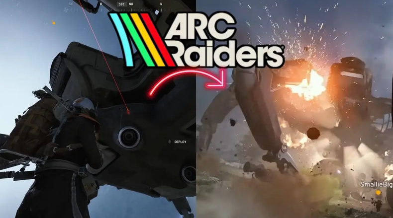
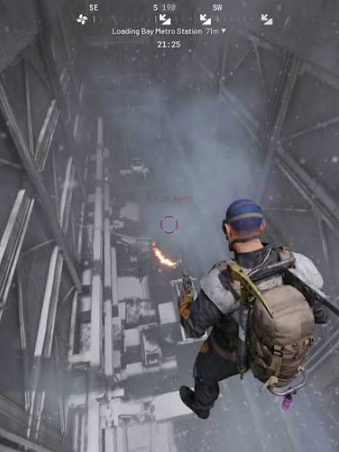
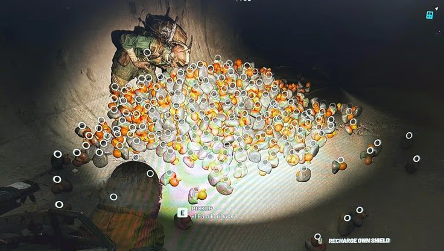

[🇧🇷 Read this Bug Report in Portuguese](ArcRaiders-pt.md)
 
## Game Description
Arc Raiders is a PvEvP extraction third-person shooter (TPS). Players enter a post-apocalyptic arena filled with various robots looking to exterminate the remainder of humanity. Players can team up to defeat them or fight each other before time runs out. Every match is a unique experience where everyone must collect as many resources as possible and prepare their extraction route. The game became very popular between late 2025 and early 2026 due to its quality and innovative approach to the extraction genre.
 
# [ArcRaiders] Glitch: Instant Queen Defeat
 
## Severity / Priority
* **Severity:** Critical (Breaks player immersion and heavily impacts matches).
* **Priority:** Very High (Allows defeating the queen improperly with ease).
 
## Status
🟢 **Fixed in December 2025**
 
## Test Environment
* **Platform:** Steam
* **Version/Year:** Discovered in 2025
* **Game Mode:** Queen Incursion
 
## Prerequisites
* Equip an incendiary trap before starting the match.
* Equip a smoke grenade, grapple, or electrical cloak before starting the match.
* Enter the Queen Incursion game mode.
 
## Reproduction Steps
1. Upon starting the match, reach the queen's location on the map as quickly as possible.
2. Use the secondary equipment to avoid being detected and killed by the queen, and set up the incendiary trap on top of or beneath her.
 
## Expected Result
The queen should react to the players' presence, and the combat should follow the normal difficulty balancing programmed for the incursion.
 
## Actual Result
Players manage to defeat the queen in seconds after using an incendiary trap close to her.
 
## Evidences
**Images** 
 
**Videos** 
https://www.youtube.com/shorts/QidVra0QyFY
 
# [ArcRaiders] Geometry Glitch across all maps (mainly Stella Montis and Space Port)
 
## Severity / Priority
* **Severity:** Critical (Allows malicious players to eliminate others through walls).
* **Priority:** Very High (Easily replicable in indoor/closed environments).
 
## Status
🟢 **Fixed in Patch 1.30**
 
## Test Environment
* **Platform:** Steam
* **Version/Year:** Discovered in 2025
* **Game Mode:** All
 
## Prerequisites
N/A
 
## Reproduction Steps
1. After starting the match, go to an indoor location.
2. Climb on top of an object and press the jump button repeatedly near the wall.
 
## Expected Result
Walls and physical environment barriers should block the player's movement, preventing any clipping or external visibility.
 
## Actual Result
Players can jump through the wall and eliminate other players without being detected or taking damage, causing equipment loss.
 
## Evidences
**Images** 
 
**Videos** 
https://www.youtube.com/shorts/_J3PPxQvl1o
 
# [ArcRaiders] Item Duplication – Rubber Ducks
 
## Severity / Priority
* **Severity:** Medium (Allows malicious players to duplicate items for sale and gain infinite income).
* **Priority:** Medium (Easily replicable, making resource acquisition too easy; needs verification if replicable with other items like weapons).
 
## Status
🟢 **Fixed in February 2026**
 
## Test Environment
* **Platform:** Steam
* **Version/Year:** Discovered in December 2025
* **Game Mode:** Game Menus
 
## Prerequisites
Collect a few rubber ducks in matches during the "Bird City" event in the Underground City.
 
## Reproduction Steps
1. After starting the match, open the inventory.
2. Select the stack containing rubber ducks.
3. Drag the item to drop it on the ground.
4. Quickly access the inventory on the same stack of ducks and split the item in half.
5. Repeat the process and head to extraction.
 
## Expected Result
The inventory should consume the item properly when dropping or splitting it, maintaining the exact count of resources without allowing anomalous duplications.
 
## Actual Result
Players are able to multiply items and sell them at the store, accumulating an exaggerated amount of currency and breaking the game's economy.
 
## Evidences
**Images** 
 
**Videos** 
https://www.youtube.com/shorts/0s3dJ5reRiE
