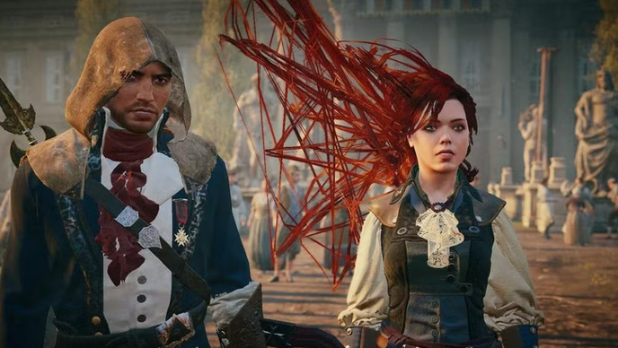
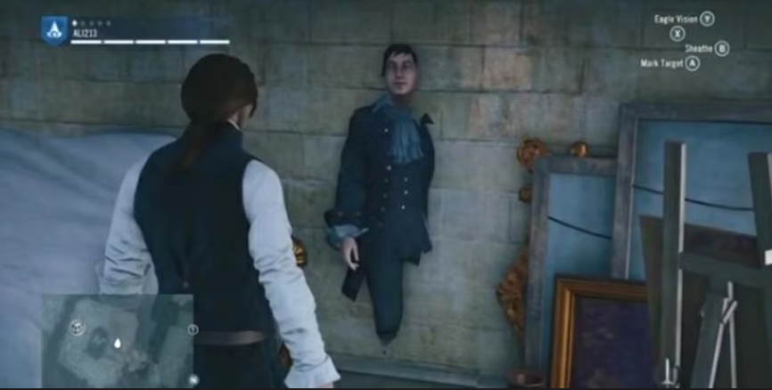
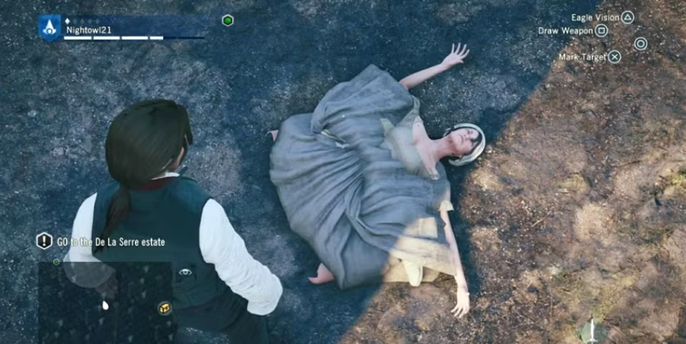

[🇧🇷 Ler este Bug Report em Português](Assassin's_Creed_Unity-pt.md)

# [Assassin's Creed Unity] Severe graphic rendering failure resulting in missing character facial textures (Facial Texture Missing)

## Game Description
Assassin's Creed Unity is an open-world action-adventure game set in Paris during the French Revolution.

## Severity / Priority
* **Severity:** High (Critical visual failure that breaks player immersion and severely degrades product aesthetic integrity).
* **Priority:** High (Occurs during core narrative elements, such as cutscenes and interactions with major NPCs).

## Test Environment
* **Platform:** Xbox One Fat (Bug replicable on PlayStation 4 and PC).
* **Version/Year:** Original launch build (2014 - 2015).
* **Game Mode:** Main Campaign / Free Roam.

## Prerequisites
* Start any main story mission containing real-time cinematics.

## Steps to Reproduce
1. Start the main story and progress to a dialogue cutscene.
2. Position the camera close to the main character's or NPCs' faces during scene transitions.
3. Observe the loading of graphic assets and facial texture media on screen.

## Expected Result
The game engine should seamlessly load and render all 3D mesh models, teeth, eyes, and skin textures for characters during cutscenes and interactions.

## Actual Result
Character facial skin textures fail to load (LOD/Texture streaming failure), displaying only eyes, teeth, and internal head structures, causing severe visual deformation.

## Evidence

