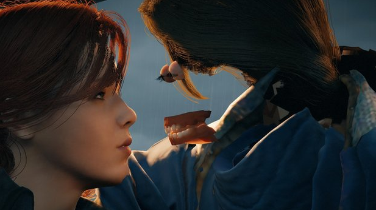

[🇺🇸 Read this Bug Report in English](Assassin's_Creed_Unity-en.md)

# [Assassin's Creed Unity] Falha grave de renderização gráfica que resulta na ausência de texturas faciais dos personagens (Facial Texture Missing)

## Descrição do Jogo
Assassin's Creed Unity é um jogo de ação e aventura em mundo aberto ambientado em Paris durante a Revolução Francesa.

## Severidade / Prioridade
* **Severidade:** Alta (Trata-se de uma falha visual crítica que quebra a imersão do jogador e afeta negativamente a integridade estética do produto).
* **Prioridade:** Alta (Ocorre em elementos centrais da narrativa, como *cutscenes* e interações com NPCs principais).

## Ambiente de Teste
* **Plataforma:** Xbox One Fat (Bug replicável em PlayStation 4 e PC).
* **Versão/Ano:** Build original de lançamento (2014 - 2015).
* **Modo de Jogo:** Campanha Principal / Modo Livre.

## Pré-requisitos
* Iniciar qualquer missão principal que contenha *cinematics* em tempo real.

## Passo a Passo para Reprodução
1. Inicie a história principal e progrida até uma cena de diálogo (*cutscene*).
2. Aproxime a câmera do rosto do personagem principal ou dos NPCs durante as transições de cena.
3. Observe o carregamento dos ativos gráficos e das mídias de textura facial dos personagens em tela.

## Resultado Esperado
O motor gráfico (*engine*) deve carregar e renderizar perfeitamente todas as malhas de modelo 3D, dentes, olhos e texturas de pele dos personagens durante as *cutscenes* e interações.

## Resultado Atual
A textura da pele do rosto dos personagens falha ao carregar, exibindo apenas os olhos, dentes e a estrutura interna da cabeça, gerando uma deformação visual severa.

## Evidências

