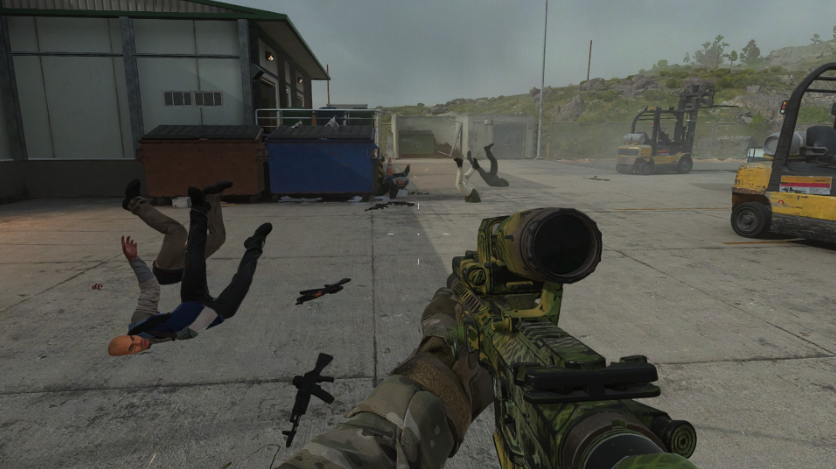

[🇺🇸 Read this Bug Report in English](Call_of_Duty_MW2_2022-en.md)

# [Call of Duty MW2 2022] Bug visual de cadáveres de inimigos atravessando a geometria do cenário (Clipping)

## Descrição do Jogo
Call of Duty: Modern Warfare II (2022) é um jogo de tiro em primeira pessoa (FPS) focado em combate tático militar.

## Severidade / Prioridade
* **Severidade:** Baixa (Trata-se de uma falha puramente visual que afeta os corpos dos inimigos mortos, sem bloquear a progressão da missão).
* **Prioridade:** Baixa (Não compromete a jogabilidade principal e tem baixo impacto na experiência geral do usuário).

## Status

🔴 **Não corrigido**

## Ambiente de Teste
* **Plataforma:** PC (Steam / Battle.net)
* **Versão/Ano:** Build atualizada (Julho/2026).
* **Modo de Jogo:** Campanha Principal / Missão 9.

## Pré-requisitos
* Selecionar a dificuldade **Veterano**.
* Progredir até a Missão 9 no modo Campanha.

## Passo a Passo para Reprodução
1. Inicie a Missão 9 no modo Campanha.
2. Siga as instruções do NPC aliado até alcançar a área dos armazéns.
3. Utilize a sniper para eliminar os inimigos à distância até o aliado ordenar a invasão dos 3 armazéns.
4. Escolha um dos armazéns, suba até o telhado e arremesse uma bomba de gás pela chaminé.
5. Elimine a maioria dos inimigos no interior do armazém, deixando apenas 1 vivo.
6. Permita que o último inimigo elimine o jogador para forçar o recarregamento do ponto de controle (*checkpoint*).

## Resultado Esperado
Após o recarregamento do *checkpoint*, os corpos dos inimigos mortos anteriormente devem ser removidos do cenário ou renderizados com a física de colisão correta sobre o piso.

## Resultado Atual
Ao recarregar o ponto de controle, os cadáveres dos inimigos reaparecem presos ou atravessando a geometria do mapa, dando a impressão de estarem caindo ou "engolidos" pelo chão e paredes.

## Evidências

