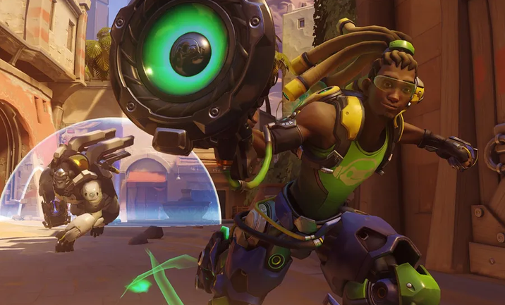
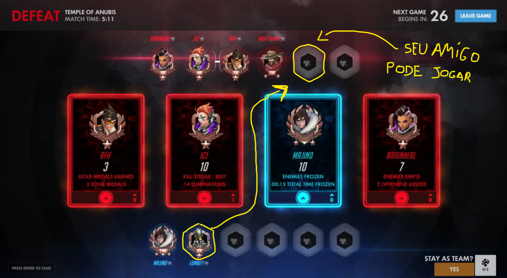

[🇺🇸 Read this Bug Report in English](Overwatch-en.md)

# Overwatch - Glitch para desbloquear a conquista 'O chão é lava' com o Lúcio de forma "desonesta"

## Descrição do Jogo

Overwatch era um jogo de tiro em equipe no formato hero shooter 6v6 lançado em 2016, fez tanto sucesso entre os jogadores ao redor do mundo que acabou vencendo o prêmio de "Game of the Year" no mesmo ano,
atualmente ele mudou de nome para Overwatch 2 e foi atualizado no formato 5v5.

## Severidade / Prioridade
* **Severidade:** Média (Permite o ganho indevido de conquistas/troféus e pode incentivar comportamento antidesportivo durante partidas casuais).
* **Prioridade:** Média (Depende de um fluxo específico de matchmaking e da saída espontânea de um jogador adversário).

## Status

🟢 **Corrigido em 2017**

## Ambiente de Teste
* **Plataforma:** Xbox One Fat (Bug replicável em PlayStation 4 e PC).
* **Versão/Ano:** Build original de lançamento (2016).
* **Modo de Jogo:** Jogo Rápido / Casual.

## Pré-requisitos
* Selecionar o herói **Lúcio** (aplicável a outros heróis como Roadhog, Symmetra e Winston).
* Estar em grupo/comunicação externa com pelo menos 1 amigo (Discord, Skype, Party do Console).
* O mapa selecionado deve conter abismos/áreas de queda (ex: Numbani).

## Passo a Passo para Reprodução
1. Entre em uma partida no modo Jogo Rápido-Casual.
2. Durante a partida, identifique a saída de um jogador no time adversário.
3. Solicite que seu amigo acesse seu perfil no menu do console/jogo e selecione a opção **"Entrar no Jogo"** para preencher a vaga do time rival.
4. Na rodada seguinte, selecione o herói Lúcio e combine um ponto isolado do mapa com o amigo.
5. Execute os requisitos da(s) conquista(s): elimine o jogador adversário (amigo) 3 vezes seguidas enquanto desliza na parede, sem morrer entre as eliminações.

## Resultado Esperado
O sistema de Matchmaking não deve permitir que amigos da mesma lista entrem em vagas abertas no time oposto em partidas públicas, evitando manipulação de partidas e de conquistas.

## Resultado Atual
O sistema permite a entrada do amigo no time adversário via "Junte-se a um amigo", possibilitando a manipulação de estatísticas e o desbloqueio facilitado de conquistas sem interferência do sistema antifraude.

## Evidências

