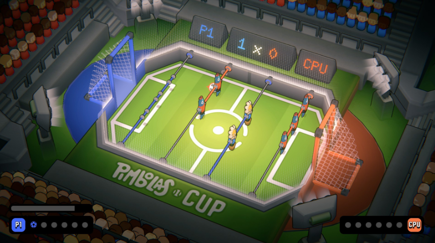

[🇧🇷 Ler este Bug Report em Português](Pimbolas-pt.md)

# [Pimbolas] Defense line figures disappear after scoring a goal using the Super Shot

## Game Description
Pimbolas is a foosball/table soccer arcade game featuring superpower mechanics, released in 2026.

## Severity / Priority
* **Severity:** Medium (Disrupts regular gameplay flow, preventing proper defense and forcing a match restart).
* **Priority:** Medium (Creates an unfair gameplay disadvantage, though the reproduction rate remains inconsistent).

## Status

🔴 **Not Fixed**

## Test Environment
* **Platform:** PC (Windows 11).
* **Version/Year:** Original launch build (2026).
* **Game Mode:** Custom Match / Classic Grass Map.

## Prerequisites
* Select the character **Frôr** for the player and **Peixe** for the CPU.
* Configure match power-ups to leave only the **Goalkeeper Glove** enabled.

## Steps to Reproduce
1. Start a Custom Match on the *Classic Grass* map.
2. Charge the Super Shot ability meter.
3. Perform the Super Shot towards the opponent's goal and score a point.
4. Observe the repositioning of the figures on the table after the play resets.

## Expected Result
After a goal is scored, all defense and midfield figures should respawn in their original table positions for the start of the next round.

## Actual Result
On sporadic occasions following the Super Shot animation, the defense line figures vanish from the field (rendering/despawn issue), leaving the area without collision and making defense impossible for the remainder of the match.

## Evidence

