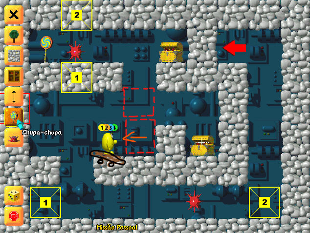

[🇺🇸 Read this Bug Report in English](Speedy_Eggbert-en.md)

# [Speedy Eggbert] Glitch de colisão permite atravessar blocos arrastáveis utilizando o skate (Collision Clipping)

## Descrição do Jogo
Speedy Eggbert é um jogo de plataforma e quebra-cabeças 3D em visão isométrica lançado originalmente em 1998.

## Severidade / Prioridade
* **Severidade:** Baixa (Permite ultrapassar obstáculos de forma indevida ao explorar a sobreposição de caixas de colisão).
* **Prioridade:** Baixa (Impacta a progressão natural de poucas fases oficiais e de cenários customizados do criador de mapas).

## Ambiente de Teste
* **Plataforma:** PC (Windows)
* **Versão/Ano:** Encontrado em 2010, mas o corre desde o lançamento em 1998.
* **Modo de Jogo:** Fases Personalizadas / Editor de Mapas.

## Pré-requisitos
* Estar em uma fase que contenha pelo menos 1 Skate e blocos de caixas arrastáveis.

## Passo a Passo para Reprodução
1. Durante a partida, localize e suba no veículo Skate.
2. Posicione o personagem com o Skate imediatamente ao lado de um bloco arrastável.
3. Desequipe o Skate no local perto do bloco arrastável.
4. Puxe o bloco de forma que ele seja movido para cima da posição onde o Skate foi deixado.
5. Ande com o personagem diretamente contra o bloco que está sobreposto ao Skate.

## Resultado Esperado
O sistema de física do jogo deve manter a caixa de colisão (*hitbox*) do bloco ativa, impedindo o movimento do personagem e travando a passagem até que o obstáculo seja movido para um espaço livre.

## Resultado Atual
Ao forçar o movimento contra o bloco posicionado sobre o Skate, ocorre uma falha na detecção de colisão (*clipping*), fazendo com que o personagem atravesse o bloco arrastável instantaneamente.

## Evidências

